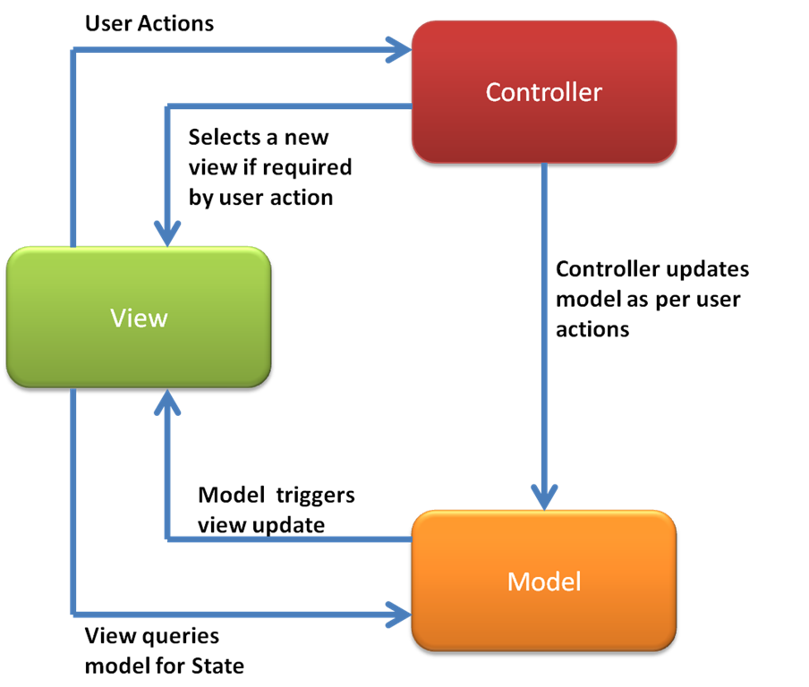

#JS Frameworks
If you have been looking at job listings lately, as I am sure a lot of you have, you will have seen a few terms popping up over and over. 

> Experience with AngularJs

or maybe

> Experience with modern client-side application frameworks (Backbone.js, Ember.js, Angular.js)

##What are these?
After seeing these terms you might have done some searching and ending up at their websites, or someones blog post about them. The are JavaScript libraries that have bean created to help make our lives easier when it comes to writing large complex JS applications.

##Why do we have these

These frameworks/libraries came out of a need for better organization and separation of concerns when it came to writing larger JavaScript applications in the browser. As you have been getting into using jQuery to build more interactive applications you might notice that you end up doing a lot in some functions, when really we should keep things as simple as possible. These libraries try to emulate a design pattern called MVC.

##What is MVC but first What is a Design Pattern?
MVC, or Model View Controller, is a design pattern that was developed back in the 70's for the smalltalk-80 language. A design pattern is a reusable solution that can be used to solve common problems. 

For example, we have been using namespaceing to organize our JS:

	var app = {};
	app.myFunction() {};

The problem this little pattern solves is spaghetti code, before this we would just create functions and call them from anywhere, there was no organization. Using the namespacing pattern, we can easily group things together. If you have a bunch of events we need to fire, we could have a `app.events()` method.

MVC solves the problem of keeping our Model(data) separate from our View and keeping our logic inside a Controller.

A diagram might look something like this:

The basic idea is that the **View** listens for events on it, when an action is triggered it talks to the **Controller** which then makes changes to the **Model** which then triggers a change in the **View** to reflect the models new information.  

That is a pretty brief example of how they might work. Lets talk a little about the three main JS frameworks that you will see in a posting. And then we will dive into the most popular, AngularJS.

###Backbone
***

Backbone is by far the most mature and oldest of the three main frameworks. And because of that reason it is not super talked about these days. In my opinion though, it is a solid library and my favourite. 

It is very small, compared to Angular or Ember. Because of this you have to be in control of a lot of things. We will see that in Angular and Ember they sort of do some *magic* that happens, when we update something they automatically make some change somewhere else. However in Backbone you have to me more concerned with what is happening. It is more of a manual process. If you make a change to some data, you have to set up the next set, does a view get updated? Does it get saved to a database somewhere? 

Backbone is a very small library, you can actually read the whole thing is you wanted [HERE](http://backbonejs.org/docs/backbone.html). Backbone and Underscore(a js library backbone depends on) are both really well documented. Because of this Backbone is often forked and extended into new, fuller featured, versions.

There are many version of it, the two most popular are [MarionetteJs](http://marionettejs.com/) and [AmpersandJS](https://ampersandjs.com/).

Some sample Backbone code would look like this:

	app.ArtWorkView = Backbone.View.extend({
		//Grabbing our template
		template: _.template($('#art-work').html()),
		initialize: function() {
			//Rendering this view
			this.render();
		},
		render: function() {
			//Find the container we want to put our view in
			//And append it
			$('.art-work').append(this.template(this.model.toJSON()));
		}
	});

This is taken from the [Backbone Example application](backbone/index.html)

Some sites in the wild that use Backbone as sites like [Rdio](http://rdio.com),[Trello](http://trello.com) and [Airbnb](https://www.airbnb.ca/)

###Ember
***

Ember is by far the largest and most difficult to get into. The learning curve is pretty steep. The tag line for Ember is *A framework for creating ambitious web applications*. The goal for Ember however is that once you get over that hump, things become very easy you don't have to do much thinking about how something works. Ember is a very opinionated framework, meaning that there is really very few ways to do something in Ember. Angular and Backbone have a bit more freedom as to how you perform a task or name something. In Ember everything is tightly controlled.

For example, if I want to create a route for a homepage, it would be called index. I would have to make an ember controller call `IndexController`:

So it might look something like this:

	App.IndexController = Ember.Controller.extend({
		//Controller code in here
	});

If I wanted a route for that same page I would follow the same patter:

	App.IndexRoute = Ember.Route.extend({
		//Route stuff goes here
	});

Ember has been picking up a lot of steam lately. Unlike Backbone, Ember is in constant development and because of that it is constantly getting better and changing. But because of that it can be hard to follow and keep up with.

I have built an example application [HERE](ember/index.html) using Ember.

Some example applications that have been build using Ember are [Fresh Books](http://www.freshbooks.com/) and [Discourse](http://www.discourse.org/). These are large complex applications that need to be organized well. 

###Angular
***

Angular is by far the most popular library at the moment. I think a lot of that has to do with the fact that it is being developed at Google, that is a name people see to like. Much like the other two, Angular follows similar conventions. Unlike Ember however, you have a bit more freedom to work with. 

Angular also has a lot of built in features for you. It has services for making ajax calls, getting animations started quickly, simple stuff like scrolling to an anchor link on your page even. And as discussed early, there is a lot of magic in AngularJS. In Backbone you do a lot of manual work, in Angular things just work for you. This can be a good and a bad thing.

Some example Angular code might look like this:

	app.controller('MainCtrl', function($scope,Art){
		//When the page is loaded get info to fill the page
		Art.getArt().then(function(result) {
			//When the promise is resolved the result is sent 
			//to the callback in the .then() method
			$scope.art = result.artObjects;
		});
		//Search function on our scope
		$scope.search = function() {
			//Get the query from the ng-model
			var query = $scope.searchQuery;
			//Send that query to your .seach() method in the factory
			Art.search(query).then(function(result) {
				//When it resolves we get our art
				$scope.art = result.artObjects;
			});
		};
	});

Unlike Backbone or Ember where you notice we did stuff like `var view = Backbone.View.extend()` or `var IndexControler = Ember.Controller.extend()`. Angular works in this fashion of using methods on the Angular object to create controllers or whatever it is you are creating. 

I have built an example application [HERE](angular/index.html) using Angular.

Example applications using AngularJS: [PS3 Youtube app](http://www.playstation.com/en-us/explore/playstationnetwork/entertainment/youtube/) and [Wanderlust](http://mywanderlust.co/)

##Are they for me? Should I learn them.

Ultimately before jumping into one of these you need to have a firm understanding of JS. Like jQuery these are not new languages, they are just libraries built to provide us with certain functionality. 

[HERE](https://www.youtube.com/watch?v=kwSVWlzEefE) is a short video by Alex McPerson that might help you understand the evolution of the type of JS you are writing. Starting from simple little programs, to plugins, to using objects to organize your code and then getting into some sort of MVC framework like Backbone, Angular or Ember. I highly recommend checking out the video.

####Resources
Backbone:
[Backbone site](http://backbonejs.org/)

Ember:
[Ember getting started](http://emberjs.com/guides/)

AngularJS:
[Shaping up with AngularJS](https://www.codeschool.com/courses/shaping-up-with-angular-js)

##Working with AngularJS
We have talked about the main three frameworks that are popular today, lets actually dig into one of them and take a look at an example from a project that will look familiar. We will use the Rijks Museum API to create an simple application were we can display all the initial art, and also search for a term

##The Setup
The first thing we need to do is set up our markup for the application.
Lets keep it really simple, it will be a basic page, and we will just include angular at the bottom as well as out own script. A starting point can be found in the `angular-base` directory.

	<!DOCTYPE html>
	<html lang="en" ng-app='art-app'>
	<head>
		<meta charset="UTF-8">
		<title>Angular Example</title>
	</head>
	<body ng-controller="MainCtrl">
		<main class="main-section">
			<header>Rijks Museum</header>
			<section class="art-work">
			</section>
		</main>
		
		
	</body>
	</html>

There are a few things to point out inside of this markup. Firs being the `ng-app="art-app"`. This is how we tell angular what markup to look at, what is considered to be our app. You do not have to have it on the `html` element if do not want but since the whole page will ne an app lets just do it anyways. The beauty of angular is that it can be used in a few places here and there, sort of like little widgets.

The next is the `ng-controller="MainCtrl"` attribute. This we will look at in a second. As you will see as we go ahead with Angular is that it is very declarative. Meaning that we put a lot of our logic into the DOM. We will see more examples of this later. 

##Initialize Application

Inside of our `script.js` file we need to initialize our Angular application. We do this in a familiar way, although at first it might not look like that. 

	var app = angular.module('art-app',[]);

What we are doing here is creating an `app` variable, `art-app` refers to the name we put in the `ng-app` attribute tag in our markup. The variable `app` will be used as our namespace, similar to how we have been writing:

	var app = {};
	app.init = function() {
		//Some stuff
	};
	app.getArt = function() {
		//Some other stuff
	};

Remember when we added the `ng-controller="MainCtrl"` to our `main` tag, we can now define that controller in our JS file.

	app.controller('MainCtrl', function() {
		...
	});

This is where we will be spending most of our time. If you remember in the MVC pattern the **Controller** is used to adjust our model, we will be doing that in here. 

In Angular the concept of the **Model** is a special variable called `$scope`. One more concept to look at is the **View** in Angular. Angular uses the HTML markup as its **View**, remember when I said that Angular is 'declarative' this is where that happens. 

Inside our markup, go to the `.art-work` section. Inside here will we will be making some changes.

	

		{{item}}
	

There are a few things happening here. There is this new attribute called `ng-repeat`. This is a build-in function, also called a Directive, of sorts from Angular, in this case `ng-repeat` is like a for loop. The value of `ng-repeat` is `item in art`, we will define `art` in a second, but this is just like a for-in loop.

	for(var key in obj) {
		console.log(key);
	}

You might have noticed that we wrap the `item` var in `{{}}`. What we are doing here is using some template tags in our HTML. Angular will go through our document when it loads and change these `{{}}` tags into the content that is inside them based on what we set.

Back in our `script.js` files lets see this in action. Inside our `controller` lets add some data that we can show on the page. This is where `art` comings into action.

	app.controller('MainCtrl', function($scope) {
		$scope.art = ['Hey','There'];
	});

If you refresh the page you will now see two lines. Hey and There. The `ng-repeat` is looping over the array we have assigned to `$scope.art` and for each iteration spitting them out as `{{item}}`. If each item was an object we could go `{{item.name}}` and access properties on it. Notice how our data was automatically added to the page? This is something called Data Binding. Angular is constantly watching an waiting for out data to change, when it does it takes the appropriate actions. 

You will have noticed that I just added the `$scope` variable. Angular has something called Dependency Injection. This is a concept where Angular will resolve any parameters passed into our function and find appropriate values. In this case we need to have access to the `$scope`. We will see this in action later on as we will create something ourselves and inject it into this controller.

###Ajax in angular

Built into Angular there is a service called `$http`. Think of this as the `$.ajax()` of angular. We will be using this to get our information from the api. 

If you remember we use the MVC pattern so we can separate our concerns, we could use the `$http` service inside our `controller` but that would make things to dependent, or tightly coupled. In Angular we have something called a factory. After our `app.controller...` on a new line add the following:

	app.factory('Art', function(){
		...
	});

Inside here we will write some reusable code for getting data from the api, as well as searching the api. Notice that the `.factory()` method takes two arguments, first a string, this will be used as the name of our factory. The second is a function we want to run when we use this factory. 

First lets add some variables for our api key and the url.

	app.factory('Art',function() {
		var apiKey = 'eO58IERD';
		var apiUrl = 'https://www.rijksmuseum.nl/api/en/collection/?key=' + apiKey;
	});

This is great but now we need to actually make an ajax call. In order to do that we need the `$http` service that is built into Angular. To make it available to use we need to inject it into our factory function. Lets also pass in something called `$q`, we will discuss this in a bit.

	app.factory('Art', function($http,$q) {
		...
	});

Great, now we have access to the `$http` service inside of our factory, which is very similar to `$.ajax`. From here we need to make the functions that we will use to get the art, and also search the api for a keyword. To do this we will return an object that has two methods on it, one called `getArt` and one called `search`.

	app.factory('Art',function() {
		var apiKey = 'eO58IERD';
		var apiUrl = 'https://www.rijksmuseum.nl/api/en/collection/?key=' + apiKey;
		
		return {
			getArt: function() {
				//Gets all the art
			},
			search: function(term) {
				//used to search for a specific term
			}
		}
	});

Lets dig into actually making the call to the api. Lets just see it in action, inside our `getArt` methods lets add this.

	getArt: function() {
		$http.get(apiUrl).success(function(results) {
			console.log(results);
		});
	},

This call should look pretty familiar this is the pattern we use when we use `$.ajax` our results come back in the `.success` function. Great, we are getting data and we are almost there. I am just going to add some code below and we will go through it, it will be a little complex, but lets walk though it. 

	getArt: function() {
		//We use a defered object to see if our request is ready
		var def = $q.defer();
		//Make the request
		$http.get(apiUrl)
			//If it is success resolve the def
			.success(def.resolve)
			//If not reject it
			.error(def.reject);
		//Return the promise so we can 
		return def.promise;
	},

Remember that `$q` service that we added? This is a little service for something called a Promise or a Deferred object. A Promise is the promise of an eventual action to happen. If you think about it like ordering something online. When you order something before it is shipped it would be considered to be *pending*. It your credit card gets rejected it would *reject* the order. If you receive the order at your home the company would *resolved* the order. In JS we can use this to wait until our ajax call comes back. 

Lets go back to our `MainCtrl` and actually use this function. Back in our controller we had initially injected `$scope` but with the magic of Angular we can now inject our `Art` service. That will now look something like this.

	app.controller('MainCtrl', function($scope,Art){
		Art.getArt().then(function(result) {
			//When the promise is resolved the result is sent 
			//to the callback in the .then() method
			$scope.art = result.artObjects;
		});
	}

I went ahead and added a bunch of stuff, but lets walk through what is happening. We call the `.getArt()` method from our `Art` service. Because we returned a `Promise` from the deferred object we can use this `.then()` method to be called when the promise is resolved, meaning we have data. When that happens the callback function gets passed the results of from our ajax call and we can go ahead and use them like we used our array at the beginning. 

If you remember from api project all the data was on a property called `.artObjects` if we set `$scope.art` to be equal to `result.artObjects` Angulars data binding will work its magic and inform the template in the HTML that is not has some information. It is instantly updated with that data.

Lets change our template to show the image and the long title.

	

		
		
{{item.longTitle}}

	

Now we are assign the title and image to HTML elements. If you refresh your page you should now see images. What about the situation when there is no image? Angular has another directive call `ng-if` that we can use to conditionally only show art with an image.

	

		
		
{{item.longTitle}}

	

We add `ng-if="item.webImage.url != null"` to the `.art-item` div, now only items that have an image will be displayed!

###What about searching?

Lets add a search form to our page in the header that we can use to get a search value.

	<header class="main-header">
		<h1>Rijks Museum</h1>
		

			<input type="text" ng-model="searchQuery">
			<input type="submit" value="search" ng-click="search()">
		

	</header>

There are two things that are not normal here. On the text `input` there is this `ng-model` attribute. This is another Angular directive we can use the value of this inside of our controller later. We also have another directive called `ng-click`. As you can imagine this is binding a click event and calling some function that we define when it is clicked. In this case the `search()` function.

Lets jump back into our controller and define this `search` function.

	$scope.search = function() {
		//Get the query from the ng-model
		var query = $scope.searchQuery;
		//Send that query to your .seach() method in the factory
		Art.search(query).then(function(result) {
			//When it resolves we get our art
			$scope.art = result.artObjects;
		});
	};

I added a bunch more things here. First thing I do is add this `search` function to our `$scope`. Next I use that `searchQuery` model I set up early to to get the value of our form, we can use that and pass it to our `Art.search()` method.

Inside our `Art` factory we should now add a `search` method to the returned object. This will look almost identical to the `getArt` one. The only difference being the argument we pass in and append to our url.

	search: function(serchTerm) {
			//Use a defered object to see if our request is ready
			var def = $q.defer();
			//Make our request
			$http.get(apiUrl+'&q='+serchTerm)
				//If it is successful resolve the def
				.success(def.resolve)
				//else reject it
				.error(def.reject);
			//Return the promise
			return def.promise;
		}

##Conclusion

That is about it for this example. This is not super in depth example, more a quick look at how you would use a framework like this to build something you already know now to build.

